# Project in R – Haberman's Survival with Machine Learning

## Introduction to Machine Learning

 
<em>Figure 1.Machine Learning Revolution</em>

Machine learning is a subfield of artificial intelligence (AI). The goal of machine learning generally is to understand the structure of data and fit that data into models that can be understood and utilized by people. Machine learning algorithms allow for computers to train on data inputs and use statistical analysis in order to output values that fall within a specific range. Because of this, machine learning facilitates computers in building models from sample data in order to automate decision-making processes based on data inputs.

## Introduction to R-Language
R is an open source programming language. It was developed by Roass Ihaka and Robert Gentleman in August 1993. And they decided the name for this language with their name’s first letter. Hence the name for this is R-Programming language, and the stable version was released in December 2018.

It has been developed for statistical computing and graphics supported by R Foundation. The R language is widely used among statisticians and data miners for statistical software and data analysis Polls, data mining surveys.

## Haberman's Survival Dataset

 

<em>Figure 2. Spread of Breast cancer cells from original place to other
parts of the body</em>

Dataset has been collected from a standard benchmark
UCI machine learning repository. A study at the hospital named University of Chicago’s Billings was conducted between the year 1958 and 1970 to identify the cancer patients who had undergone surgery for breast cancer and survived. Classifying patient’s survival after five years and
patients death within five years is a challenging prognosis
problem. The effectiveness of the classification achieved
can be used by the clinicians for the treatment of patients in
the hospitals.

## Our Project Phases
  1. Project proposal submission.

  2.Learning about data pre-processing.

  3.Learning the methods.

  4.Submit project milestone.

  5.Preparing the final version and publicity.

## Procedures
### - Data Preprocessing
It usually contains phases like :
#### 1) Feature Selection  
Our features were only three and all of them were extremely essential for predicting the output.

##### The 3 features are :
1. Age of patient at time of operation (numerical)
2. Patient's year of operation (year - 1900, numerical)
3. Number of positive axillary nodes detected (numerical)

- The Predicted Output Survival status (class attribute)
    -  1 = the patient survived 5 years or longer
    -  2 = the patient died within 5 year

#### 2) Feature Scaling
Some Features may need normalization to get rid of a number of anomalies that can make analysis of the data more complicated. Indeed, it is usually through data normalization that the information within a database can be formatted in such a way that it can be visualized and analyzed.

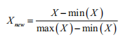

 

<em>Figure 3. Normalization Rule</em>

#### 3) Data imputation
It is a process of replacing missing data with some meaningful substitute.
Luckily, our data have no missing values.

#### 4) Data Encoding
Many machine learning algorithms cannot operate on label data directly. They require all input variables and output variables to be numeric.

In general, this is mostly a constraint of the efficient implementation of machine learning algorithms rather than hard limitations on the algorithms themselves.

This means that categorical data must be converted to a numerical form. If the categorical variable is an output variable, you may also want to convert predictions by the model back into a categorical form in order to present them or use them in some application.

### - Methodology :
#### 1. Logistic Regression
  The logistic regression is a statistical model.  Logistic regression is predictive analysis and used to describe data and to explain the correlation between one dependent binary variable and one or more nominal, ordinal, interval or ratio-level independent variables.
#### 2. KNN
 A k-nearest-neighbor is a data classification algorithm that attempts to determine what group a data point is in by looking at the data points around it.
#### 3. Decision Tree
A decision tree is a map of the possible outcomes of a series of related choices. It allows an individual or organization to weigh possible actions against one another.  It is a diagram or chart that people use to determine a course of action or show a statistical probability.

### - Coding Steps

Note: Our positive class is 1 so Specificity and Sensitivity values will be exchanged.
### Importing Data :

### Encoding Categorical Data

### Assigning the data to training set and test set & Feature Scaling :

### Including needed Libraries :

### Logistic Regression Model :
  - Accuracy , Sensitivity , Specificity :

  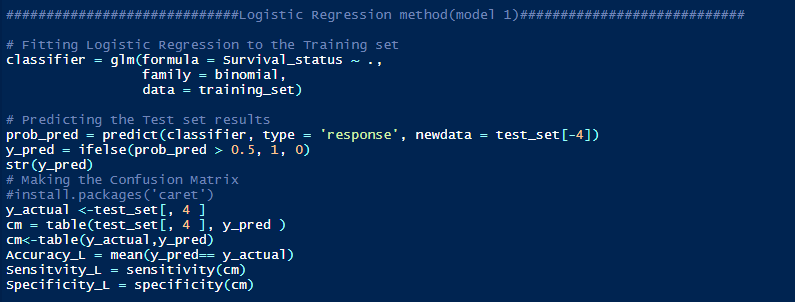

  - Results :

  

  - Accuracy Using **k-Fold Cross Validation** :

  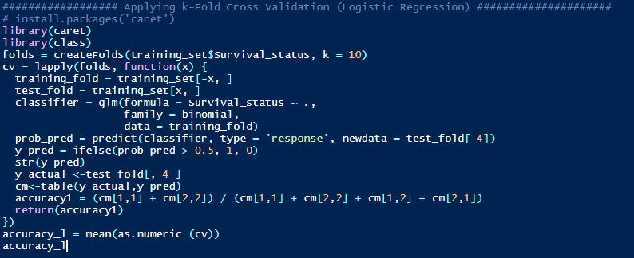

  - Results :

  

### KNN Model :

- Accuracy , Sensitivity , Specificity :

  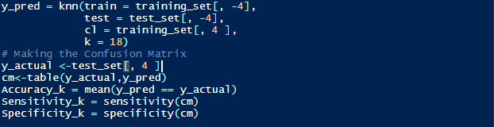

- Results :

  

- Accuracy Using **k-Fold Cross Validation** :

  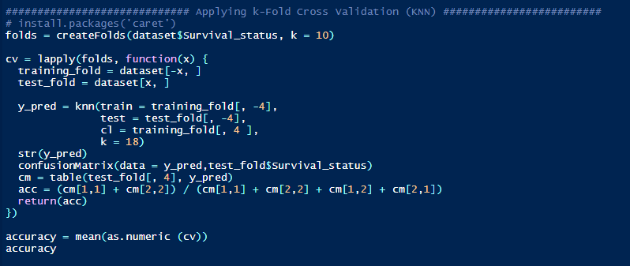

- Results :

  

### Decision Tree Model :

- Accuracy , Sensitivity , Specificity :

  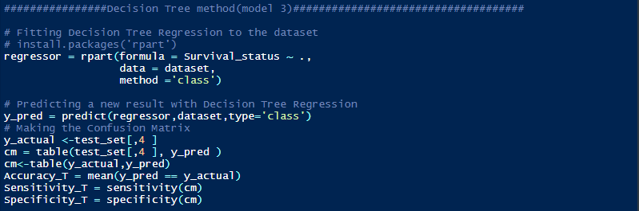

- Results :

  

- Accuracy Using **k-Fold Cross Validation** :

  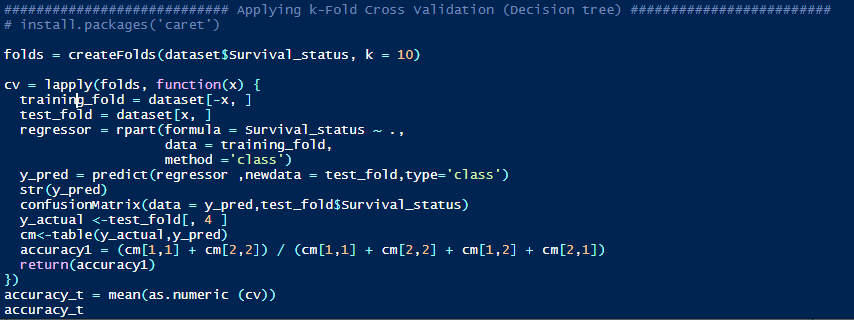

- Results :

  

### - Results Visualization
We tried to visualize our features in 3D space.

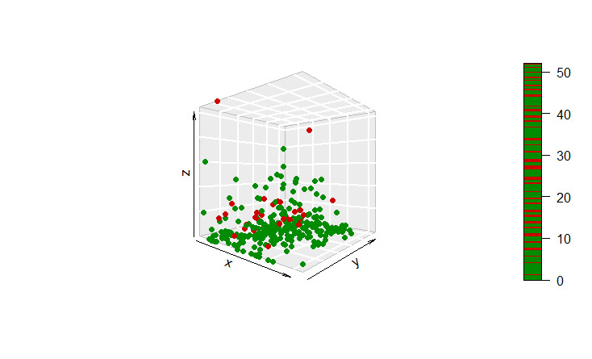

According to PCA(Principal Component Analysis),

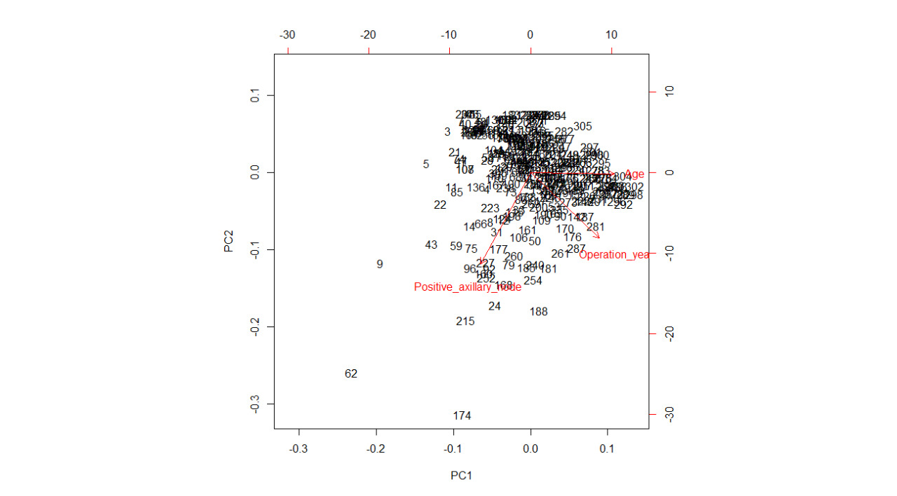

We decided to exclude one feature from the three which is the operation year of
the patients, as the two other features are more effective (Age & Number of positive axillary nodes). This allowed us to easily visualize our features in 2D space.

- Logistic Regression Model

  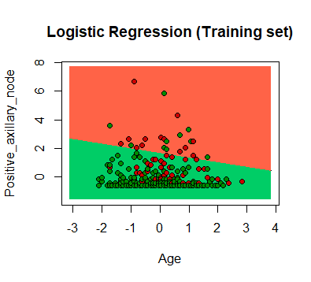

- KNN Model

  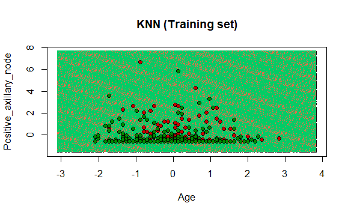

- Decision Tree Model

  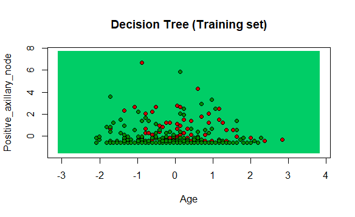

## What we learned from this project :

1. What is Machine Learning.
2. How to choose and collect the parameters of data.
3. Improving the quality of data.
4. Learning how to make a pre-processing for data before working on it.
5. How to deal with R studio and using it in visualizing our data.
6. Learning methods of classification for example:

      * Decision Trees.
      * K-nearest neighbors (KNN).
      * Logistic regression.

##  Future Work
We will try to plot our features in 3D space to be more clear and realistic in the future.

##  Team Members :
[Omar Abdelzaher Ahmed](https://omarabdelzaher.github.io/Omar_Abdelzaher/)

[Sara Adel Abdelwahab](https://saraadel540.github.io/Sara-Adel/)

[Ahmed Adel Ahmed](https://aaa2021.github.io/Ahmed-Adel/)

[Rawan Sayed Badr](https://rawansayed.github.io/Rawan-Sayed/)
