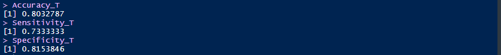

# Project in R – Haberman's Survival with Machine Learning

## Introduction to R-Language
R is an open source programming language. It was developed by Roass Ihaka and Robert Gentleman in August 1993. And they decided the name for this language with their name’s first letter. Hence the name for this is R-Programming language, and the stable version was released in December 2018.

It has been developed for statistical computing and graphics supported by R Foundation. The R language is widely used among statisticians and data miners for statistical software and data analysis Polls, data mining surveys.

## Haberman's Survival Dataset

Dataset has been collected from a standard benchmark
UCI machine learning repository. A study at the hospital named University of Chicago’s Billings was conducted between the year 1958 and 1970 to identify the cancer patients who had undergone surgery for breast cancer and survived. Classifying patient’s survival after five years and
patients death within five years is a challenging prognosis
problem. The effectiveness of the classification achieved
can be used by the clinicians for the treatment of patients in
the hospitals.

## Procedures
- Data Preprocessing
- Models Building (3 Methods) :
  - Logistic Regression
  - KNN
  - Decision Tree
- Results Visualization

## Coding Steps

#### Importing Data :

### Assigning the data to training set and test set & Feature Scaling :

### Including needed Libraries :

### Logistic Regression Model :
  - Accuracy , Sensitivity , Specificity **without** k-Fold Cross Validation

  

  - Results :

  

  - Accuracy , Sensitivity , Specificity **Using** k-Fold Cross Validation

### KNN Model :

- Accuracy , Sensitivity , Specificity **without** k-Fold Cross Validation

  

- Results :

  

- Accuracy , Sensitivity , Specificity **Using** k-Fold Cross Validation

### Decision Tree Model :

- Accuracy , Sensitivity , Specificity **without** k-Fold Cross Validation

  

- Results :

  

- Accuracy , Sensitivity , Specificity **Using** k-Fold Cross Validation
